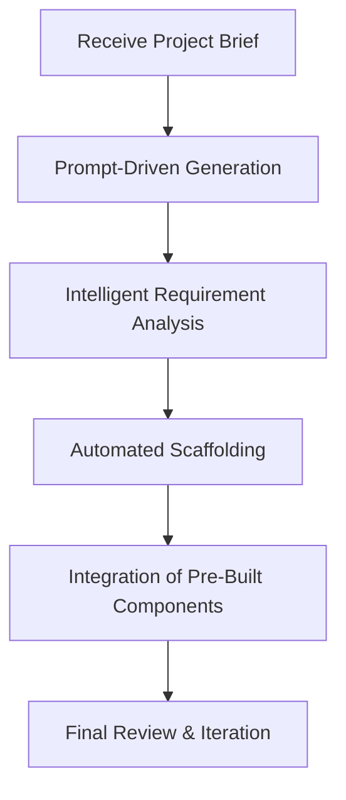

# Use Case 3: Greenfield Development - Accelerating New Project Starts

Greenfield Development leverages state-of-the-art AI technologies to accelerate the initiation of new projects. This approach harnesses the power of prompt-driven generation, intelligent analysis, and automated scaffolding to deliver rapid results and seamless integration of pre-built components.

- **Prompt-Driven Generation:** Quickly generate initial project frameworks using predefined prompts.
- **Intelligent Analysis:** Leverage AI to analyze requirements and suggest optimal architecture patterns.
- **Automated Scaffolding:** Automatically create project structures, reducing manual setup times.
- **Integration of Pre-Built Components:** Seamlessly integrate proven modules to jumpstart development.

Below is a Mermaid diagram illustrating the workflow for Greenfield Development:

<!-- 
Speaker Notes:
In this slide, we explore the concept of Greenfield Development within the Kore Innovation Hub. The focus is on significantly reducing project initiation times by utilizing cutting-edge AI:
1. The process begins when a new project brief is received.
2. Using a prompt-driven generation strategy, the system drafts an initial project framework.
3. The AI then performs intelligent analysis to understand requirements and optimize the architecture.
4. Automated scaffolding sets up the necessary project structure, ensuring consistency and quality.
5. Lastly, pre-built components are integrated, enabling the team to focus on customization and innovation rather than reinventing the wheel.
This streamlined approach not only accelerates the development process but also enhances the overall quality and scalability of the project.
-->