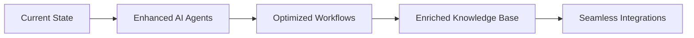

# The Kore Roadmap: Building the Future, Together

Our vision for Kore is built on four key pillars:

- **Agent Intelligence:** Empowering your organization with continuously evolving, self-learning AI agents.
- **Workflow Optimization:** Streamlining processes to enable faster, more efficient decision-making.
- **Knowledge Enrichment:** Continuously integrating enterprise insights into a centralized, scalable knowledge base.
- **Seamless Integrations:** Connecting diverse systems for an uninterrupted digital ecosystem.

Below is a dynamic roadmap illustration that highlights our strategic milestones:

<!--
Speaker Notes:
In this slide, we present the roadmap for the future of Kore, emphasizing our commitment to continuous innovation. Highlight the evolution from our current state to a future enriched with advanced AI agents that drive workflow efficiencies, enable robust knowledge enrichment, and support seamless integrations. The roadmap graphic and Mermaid diagram together provide a clear visual path of our strategic milestones, reinforcing our vision of building the future, together.
-->